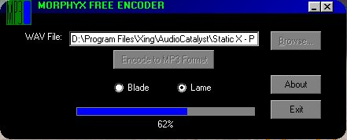

<div align="center">

## Morphyx MP3 Encoder


</div>

### Description

What do you get when you combine two programming languages? Morphyx. I've been working on this program for about two years (mainly research) and I finally just decided to take one section out of the big program and give you an encoder. (The FULL version, which isn't freeware OR open source, encodes/decodes MP3s, rips CD tracks to WAV or MP3, burns CD tracks from WAV or MP3 and also creates MP3 discs, plays EVERY type of media file including videos, connects to Napster, records sound via microphone, records video via web cam, etc. etc. etc.)

Morphyx Encoder gives you a choice of two encoding engies: LameEnc and Blade. Note that this is NOT command-line encoding. This is done through an encoding API (BLADEENC.DLL or LAME_ENC.DLL) with a wrapper DLL (MORPHYX.DLL). I included the full source to MORPHYX.DLL, but neither BLADEENC.DLL or LAME_ENC.DLL, because, well, I didn't those. =)

Morphyx EXE: Visual Basic

Morphyx DLL: C

BLADEENC.DLL: more than likely C or C++

LAME_ENC.DLL: more than likely C or C++
 
### More Info
 
File name of WAV, which encoder you wish to use

0 if successful, -1 if error


<span>             |<span>
---                |---
**Submitted On**   |2000-09-26 17:28:48
**By**             |[Jonathan Smith](https://github.com/Planet-Source-Code/PSCIndex/blob/master/ByAuthor/jonathan-smith.md)
**Level**          |Advanced
**User Rating**    |4.2 (42 globes from 10 users)
**Compatibility**  |VB 5\.0, VB 6\.0
**Category**       |[Sound/MP3](https://github.com/Planet-Source-Code/PSCIndex/blob/master/ByCategory/sound-mp3__1-45.md)
**World**          |[Visual Basic](https://github.com/Planet-Source-Code/PSCIndex/blob/master/ByWorld/visual-basic.md)
**Archive File**   |[CODE\_UPLOAD103231012000\.zip](https://github.com/Planet-Source-Code/jonathan-smith-morphyx-mp3-encoder__1-11804/archive/master.zip)

### API Declarations

```
'User interface API declarations
Public Declare Sub ReleaseCapture Lib "user32" ()
Public Declare Function SendMessage Lib "user32" Alias "SendMessageA" (ByVal hWnd As Long, ByVal wMsg As Long, ByVal wParam As Long, lParam As Any) As Long
Public Declare Function SetWindowRgn Lib "user32" (ByVal hWnd As Long, ByVal hRgn As Long, ByVal bRedraw As Boolean) As Long
Public Declare Function GetClientRect Lib "user32" (ByVal hWnd As Long, lpRect As RECT) As Long
Public Declare Function CreateRoundRectRgn Lib "gdi32" (ByVal X1 As Long, ByVal Y1 As Long, ByVal X2 As Long, ByVal Y2 As Long, ByVal X3 As Long, ByVal Y3 As Long) As Long
'API declarations for encoding wrapper
Public Declare Function SetEncoder Lib "morphyx.dll" (ByVal enc As MP3ENC) As Long
Public Declare Function EncodeMp3 Lib "morphyx.dll" (ByVal lpszWavFile As String, lpCallback As Any) As Long
```


